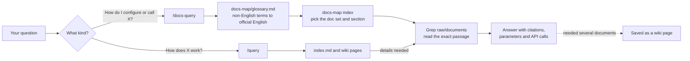

<div align="center">

# 🛩️ Drone Knowledge Wiki

**Ask a drone question in plain language.<br>Get an answer grounded in the official PX4, QGroundControl and MAVSDK-Python documentation — with the exact parameter, API call and page to open next.**

An LLM-maintained knowledge base for [Claude Code](https://claude.com/claude-code) and [Obsidian](https://obsidian.md),<br>following Andrej Karpathy's [LLM Wiki](https://gist.github.com/karpathy/442a6bf555914893e9891c11519de94f) pattern.

[](LICENSE)
[](LICENSES/CC-BY-4.0.txt)
[](docs-map/index.md)
[](docs-map/px4.md)
[](docs-map/qgc.md)
[](docs-map/mavsdk.md)
[](https://claude.com/claude-code)
[](https://obsidian.md)

</div>

---

## Why

Language models explain drones well, but they are unreliable about exact parameter names, default values and version differences. PX4 alone has close to a thousand documentation pages, and the parameter you remember may have been renamed in the version you are reading.

This repository gives Claude Code a local, versioned copy of the official documentation and a fixed way to search it:

- **No answering from memory.** Answers are built from passages found in `raw/documents/`, and the files are cited.
- **Answers that cross projects.** The PX4 docs don't show the MAVSDK call, and the MAVSDK docs don't list PX4's preconditions. The wiki pages connect them.
- **Chinese questions work too.** The documents are English only. A glossary maps 100 Chinese terms (解鎖 → `arming`, 電子調速器 → `ESC`) to the words the documents actually use, with real hit counts.
- **Readable by people.** Open the folder in Obsidian and every link between wiki pages and documents works.

## What's inside

| Layer | What it is | Size |
| --- | --- | ---: |
| [`raw/documents/`](raw/documents) | Official documentation as Markdown. Upstream folder structure is kept, and every file records its source URL and upstream commit | 1,075 pages |
| [`docs-map/`](docs-map/index.md) | Generated routing layer: an index per doc set, a page list per section, the Chinese–English glossary and a manifest | 104 sections |
| [`wiki/`](index.md) | Curated concept, topic and how-to pages that connect the doc sets | 19 pages |
| [`.claude/commands/`](.claude/commands) | The `/docs-query` and `/query` commands | 2 |
| [`bases/`](bases) | Obsidian Bases dashboards built on the wiki's frontmatter | 8 |
| [`scripts/`](scripts) | Integrity check and index generators | 3 |

### Documentation snapshot (captured 2026-07-28)

| Doc set | Pages | Version | Upstream | Licence |
| --- | ---: | --- | --- | --- |
| PX4 Autopilot User Guide | 961 | `main` @ `9467506` | [PX4/PX4-Autopilot `docs/`](https://github.com/PX4/PX4-Autopilot/tree/main/docs) | CC BY 4.0 |
| QGroundControl User Guide | 73 | `Stable_V5.0` @ `cb6ee48` | [mavlink/qgroundcontrol `docs/`](https://github.com/mavlink/qgroundcontrol/tree/Stable_V5.0/docs) | Apache-2.0 or GPL-3.0 (dual) |
| MAVSDK-Python API reference | 41 | 3.17.2 | [mavlink/MAVSDK-Python](https://github.com/mavlink/MAVSDK-Python) (converted from the published HTML) | BSD-3-Clause |

When the snapshot was captured, each doc set was compared with the full page list of its official website: **0 pages missing**. A 40-page spot check of the stored text matched the live pages at 97.4 % on average. Details are in [`docs-map/coverage-report.md`](docs-map/coverage-report.md). Pages with no content of their own (navigation-only indexes, redirect stubs) were left out on purpose; they are listed with reasons in [`docs-map/dropped.json`](docs-map/dropped.json).

### Wiki pages

| Area | Pages |
| --- | --- |
| Overviews | [drone-software-stack](wiki/topics/drone-software-stack.md) · [px4-flight-stack](wiki/topics/px4-flight-stack.md) |
| Flight control & tuning | [control-allocation](wiki/concepts/control-allocation.md) · [flight-modes](wiki/concepts/flight-modes.md) · [pid-tuning](wiki/concepts/pid-tuning.md) · [px4-parameters](wiki/concepts/px4-parameters.md) |
| State estimation & perception | [collision-prevention](wiki/concepts/collision-prevention.md) · [ekf2](wiki/concepts/ekf2.md) · [rtk-gnss](wiki/concepts/rtk-gnss.md) · [visual-inertial-odometry](wiki/concepts/visual-inertial-odometry.md) |
| Autonomy & programmatic control | [mission-planning](wiki/concepts/mission-planning.md) · [offboard-control](wiki/concepts/offboard-control.md) · [ros2-px4-bridge](wiki/concepts/ros2-px4-bridge.md) |
| Safety & simulation | [failsafe](wiki/concepts/failsafe.md) · [flight-log-analysis](wiki/concepts/flight-log-analysis.md) · [geofence](wiki/concepts/geofence.md) · [sitl-simulation](wiki/concepts/sitl-simulation.md) |
| Middleware | [uorb-messaging](wiki/concepts/uorb-messaging.md) |
| How-to | [mavsdk-takeoff-and-land](wiki/howto/mavsdk-takeoff-and-land.md) |

> [!NOTE]
> **Why only 19 pages for 1,075 documents?** On purpose. Search already reaches the original text, which carries the exact defaults, units and edge cases. A summary of every page would be less precise than the original and would go stale with every PX4 change. Wiki pages are written only where the documentation can't help on its own: connecting doc sets, bridging research and implementation, recording hands-on experience, and keeping answers that took several documents to assemble.

## How it works



`CLAUDE.md` holds the rules Claude Code follows: the retrieval order, the frontmatter standard, link conventions, tags, and when a new page is worth writing.

## Quick start

**You need** [Claude Code](https://claude.com/claude-code) and git. Optional: [Obsidian](https://obsidian.md) for browsing, and Python 3.9+ with PyYAML for the checks.

```bash
git clone https://github.com/JeremyHo1123/drone-knowledge-wiki.git
cd drone-knowledge-wiki
claude
```

Then ask:

```text
/docs-query What does PX4 do when the offboard setpoint stream stops, and which parameters control it?
/docs-query How do I limit the maximum tilt angle of a multicopter?
/docs-query In MAVSDK-Python, how do I wait for a valid position estimate before taking off?
/query What is the difference between collision prevention and obstacle avoidance?
/docs-query 解鎖前的預飛檢查失敗，要去哪裡看原因？
```

A good answer cites files such as `raw/documents/PX4/flight_modes/offboard.md` and writes parameter names exactly as the documentation does.

## Open it in Obsidian

1. In Obsidian, choose **Open folder as vault** and select the cloned folder.
2. Start at `index.md`. Links between wiki pages and documents resolve, and the graph view shows how the concepts connect to the documentation.
3. The dashboards in `bases/` need the **Bases** core plugin, available in recent Obsidian versions.

Images inside the documents point to `raw.githubusercontent.com`, so they only load with an internet connection.

## Commands

| Command | Ask it things like | What it does |
| --- | --- | --- |
| `/docs-query` | "How do I configure X?" · "Which parameter controls Y?" · "How do I call Z in MAVSDK?" | Picks the doc set, translates non-English terms with the glossary, narrows the section with `docs-map/`, Greps `raw/documents/` and answers with citations. If the answer had to be assembled from two doc sets, or from three or more documents, it can save it as a `wiki/howto/` page. |
| `/query` | "How does X work?" · "What is the difference between A and B?" | Starts from `index.md` and the wiki pages, goes down to `raw/` when details are needed, and folds genuinely new findings into existing pages instead of piling up copies. |

This edition ships only these two query commands. Workflows for importing papers or re-syncing the documentation are not included.

## Pair it with Drone LLM Council

The wiki tells you **what the documentation says**. [**Drone LLM Council**](https://github.com/JeremyHo1123/drone-llm-council) helps you decide **what to do about it**. Five advisors (Safety & Failure Modes, Domain Principles, Verification, Field Operations, First Principles) analyse a decision independently and review each other blind. The host then writes a verdict listing the claims to verify first.

The two work well together because a council is only as good as the facts in its brief. Run the council from this folder and its advisors can check claims against the wiki and the documentation, tagging them `[verified: raw/documents/…]` instead of guessing.

```text
# 1. Gather the facts
/docs-query What does PX4 do when the offboard setpoint stream stops, and which parameters control it?

# 2. Decide with the council
/drone-llm-council Our companion computer could crash mid-flight. Should we rely on PX4's offboard-loss failsafe, or add our own watchdog that switches to Hold?
```

To install the council, copy one folder into `~/.claude/skills/` — see [its README](https://github.com/JeremyHo1123/drone-llm-council#install).

## Repository layout

```text
drone-knowledge-wiki/
├── CLAUDE.md                 rules and schema Claude Code follows
├── index.md                  table of contents of the wiki
├── THIRD_PARTY_NOTICES.md    attribution for the bundled documentation
├── raw/
│   ├── documents/            PX4 · QGC · MAVSDK documentation (read-only)
│   ├── articles/             web clippings
│   └── papers/               empty — add your own
├── docs-map/                 generated routing layer
│   ├── index.md
│   ├── glossary.md           Chinese terms → official English terms
│   ├── px4.md  px4/          PX4 index + one page list per section (90)
│   ├── qgc.md
│   ├── mavsdk.md
│   ├── manifest.json
│   ├── dropped.json
│   └── coverage-report.md
├── wiki/
│   ├── topics/
│   ├── concepts/
│   └── howto/
├── bases/                    Obsidian Bases dashboards
├── templates/                page templates
├── scripts/                  check-integrity · build-docs-map · build-glossary
├── LICENSES/                 upstream licence texts
└── .claude/
    ├── commands/             /docs-query · /query
    └── settings.json         pre-approves the read-only tools (Read, Glob, Grep)
```

## Extending the wiki

- **Read the rules first.** `CLAUDE.md` defines the frontmatter, links, tags and the four situations where a new page is worth writing. Claude Code loads it automatically.
- **Start from a template.** Use `templates/wiki-page-template.md` or `templates/howto-template.md`.
- **Add papers and articles.** Put them in `raw/papers/` or `raw/articles/`, then ask Claude Code to connect them to the existing concept pages.
- **Check before you commit:**

  ```bash
  pip install pyyaml
  python scripts/check-integrity.py    # must finish with 0 errors
  ```

- **After editing `docs-map/manifest.json` or `docs-map/dropped.json`, rebuild the indexes:**

  ```bash
  python scripts/build-docs-map.py
  python scripts/build-glossary.py
  ```

## Limitations

- **A snapshot, not a live mirror.** The documents date from 2026-07-28 and are not updated automatically. The conversion pipeline is not part of this repository.
- **PX4 `main` is ahead of released firmware.** Some parameters in the documents don't exist in older releases, and some older ones are gone. For example, `main` replaces `COM_RC_OVERRIDE` with `MAN_OVERRIDE_SPD`, while v1.17 firmware still uses `COM_RC_OVERRIDE`. For the firmware on your vehicle, confirm in the PX4 source at that release tag.
- **Not a safety authority.** Use it to find the right documentation faster — not to skip simulation, props-off tests or the checks your vehicle needs.

## License

| Part | License |
| --- | --- |
| Scripts, Claude Code commands, configuration, Bases and templates | [MIT](LICENSE) |
| Wiki text: `wiki/`, `index.md`, `CLAUDE.md` | [CC BY 4.0](LICENSES/CC-BY-4.0.txt) |
| `raw/documents/PX4/` | CC BY 4.0 — PX4 documentation contributors |
| `raw/documents/QGC/` | Apache-2.0 or GPL-3.0 — QGroundControl project |
| `raw/documents/MAVSDK/` | BSD-3-Clause — © 2020 MAVSDK Development Team |

Attribution and the changes made to the bundled documentation are listed in [`THIRD_PARTY_NOTICES.md`](THIRD_PARTY_NOTICES.md).

## Acknowledgements

- The authors of the [PX4](https://docs.px4.io), [QGroundControl](https://docs.qgroundcontrol.com) and [MAVSDK](https://mavsdk.mavlink.io) documentation. The knowledge in `raw/documents/` is theirs.
- Andrej Karpathy, for the [LLM Wiki](https://gist.github.com/karpathy/442a6bf555914893e9891c11519de94f) pattern this repository follows.

This is an independent community project. It is not affiliated with or endorsed by PX4, Dronecode, QGroundControl or MAVSDK.
